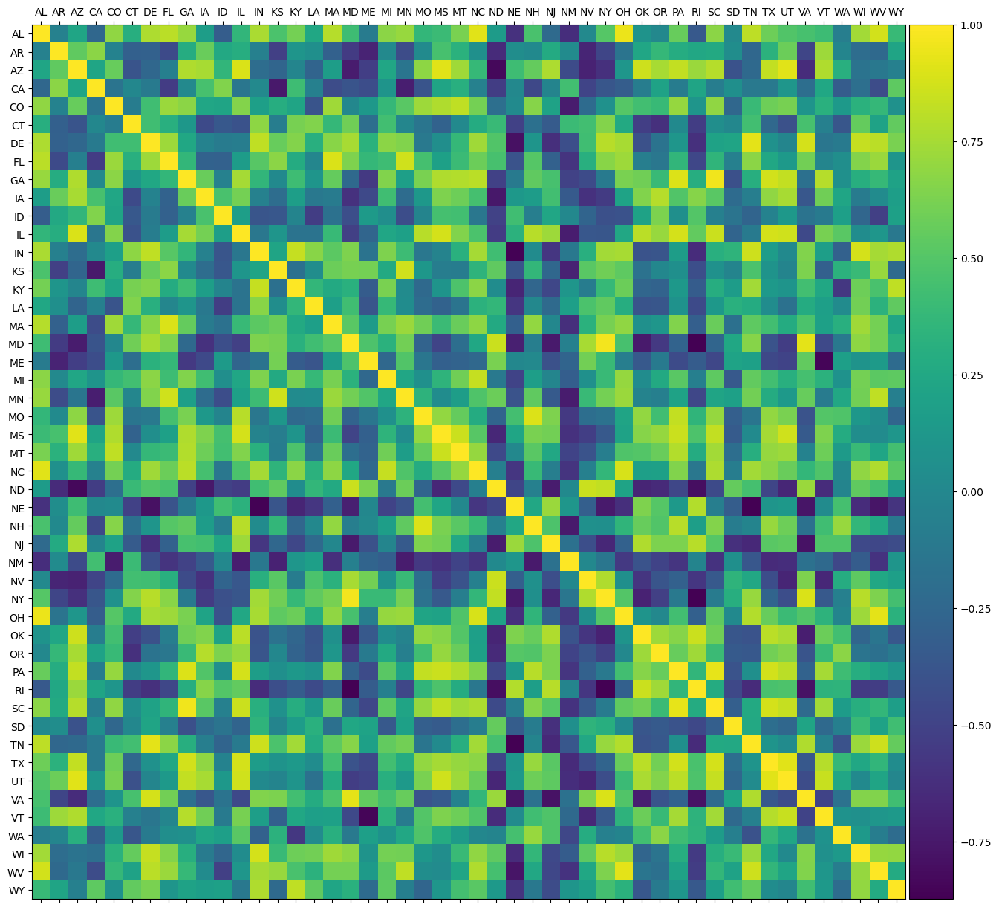

# WHO REGULATES THE REGULATORS? Evaluating CO2 Emissions Reduction Programs

<!-- ## About Team Who Regulates the Regulators?
Team members: Jared Able, Joshua Jackson, Zachary Brennan, Alexandria Wheeler, Nicholas Geiser
-->

# Table of Contents
1. [Introduction](#Introduction)
2. [Dataset Generation](#Dataset-Generation)
3. [Exploratory Data Analysis](#Exploratory-Data-Analysis)
4. [Modeling Approach](#Modeling-Approach)
5. [Results](#Results)
6. [Future Work](#Future-Work)
7. [Description of Repository](#Description-of-Repository)

## Introduction

The [Regional Greenhouse Gas Initiative](https://www.rggi.org)(RGGI) is an emissions trading system among northeastern US states to reduce carbon dioxide emissions from electric power generation. This project analyzes the causal effect of RGGI on carbon dioxide emissions from 2009 to 2014 using a synthetic control technique for the states in RGGI during this initial period.  

RGGI's causal effect in each state-year is the difference between actual emissions and the potential emissions that would have occurred had RGGI not been implemented. Estimating RGGI's causal effect therefore requires estimating this potential outcome as well as data on actual emissions in RGGI states. Unfortunately, we do not directly observe this counterfactual outcome. The synthetic control method, originally developed by Abadie and Gardeazabal [(2003)](https://doi.org/10.1257/000282803321455188), estimates the counterfactual by constructing a control on the basis of a weighted combination of actual controls that minimizes the difference between the treated unit and the synthetic control on the outcome variable. These weights are chosen to minimize the differences between the synthetic and treated state before the intervention. 

## Dataset Generation

Our dataset combines EPA emissions data from 1990-2020 with economic, demographic, and meteorological data—such as GDP, population size, electricity usage, and temperature—as some key covariates of emissions. These data are retrieved from the following sources:

* [Clean Air Markets Program Data](https://campd.epa.gov/) (CAMPD): Provides power plant information and monthly power plant carbon dioxide emissions information at the facility level. We sum the emissions at the state level and leverage aggregate information about the power plants in the state as a covariate. These data are the same data used in the official [RGGI Dashboard](https://www.rggi.org/allowance-tracking/emissions/dashboard). CAMPD data is only reliable in 1997 and onward. For earlier emissions data, we rely on the EIA.
* [Energy Information Administration](https://www.eia.gov/state/seds/seds-data-complete.php?sid=US#Keystatisticsrankings) (EIA): Provides yearly power facility emissions information on a per state basis through a public API. Additional information, such as the amount of energy flowing into and out of a state and the type of fuel used to generate electricity, are also provided. Monthly values are estimated with a weighted average method, with weights derived from CAMPD data.
* [Bureau of Economic Analysis](https://apps.bea.gov/histdatacore/HistFileDetails.html?HistCateID=1&FileGroupID=298) (BEA): Provides GDP information at the state level on a yearly basis. Monthly GDP is estimated with linear interpolation.
* [US Census Bureau](https://data.census.gov/): Provides state population information on a yearly basis. The United States Census is only taken once per decade, so yearly values are the result of careful estimation by the US Census Bureau. We once again interpolate to estimate monthly values. In addition, we consult the [data-USstates](https://github.com/jakevdp/data-USstates/tree/master) GitHub repository to retrieve the area encompassed by each state; these values were scraped from the US Census Bureau.
* [National Centers for Environmental Information](https://www.ncei.noaa.gov/cdo-web/search) (NCEI): Provides well-documented global monthly normals climate data, including average monthly temperature, monthly precipitation values, and monthly snow values. We estimate the climate data for a given state by choosing a single representative weather station from each state, often an international airport or a university where available. Temperature and precipitation for a state often contains a small number of random missing values. Missing temperature values are computed by interpolating over the adjacent months. Missing precipitation amounts are computed by averaging the values of the same month in adjacent years. Snow values are often missing in states where little snow is expected; as such, missing snow values are set to zero.

To place states on even footing in the modeling process, features are computed as per capita quantities where reasonable by dividing by the US Census population estimates. Population itself is used as a feature by computing a population density with state area information.

Further processing includes the application of twelve-month moving averages on all features to smooth data and reduce seasonal oscillation. A winsorization technique for clipping extreme values is applied to eliminate outliers in messy spectra, and Box-Cox and log transforms are applied to reduce skew.

A catalogue of features and their sources may be found in `SharedData/total_state_data_info.csv`.

## Exploratory Data Analysis

Our exploratory analysis focused on visualizing pollution data from various US states and energy flows among US states. 

In addition, we explored data quality issues and applied winsorization corrections to CO2 emissions data (our primary dependent variable). The goal of this was to remove extreme values and de-noise our data.

We also explored a naïve time-series forecast for the state of Delaware:

We identified gaps between energy consumption and use in each state and explored energy dat through (partial) autocorrelation plots and stationarity checks for each state. 

## Modeling Approach

This analysis employs synthetic control methods, which allow one to estimate the effect of an intervention when a direct control group isn’t available. Specifically, a synthetic control is constructed by assigning optimized weights to a set of control states. These weights are chosen to minimize the differences between the synthetic and treated state before the intervention. 

We employ an augmented synthetic control, allowing for both positive and negative weights in order to increase model accuracy, as described in Ben-Michael, Feller, and Rothstein [(2021)](https://doi.org/10.1080/01621459.2021.1929245). With an intervention date of January 1, 2009, the model was trained on data from 1999 to 2009 and evaluated from 2009 to 2014. The model uses 10 transformed features and a donor pool of 33 non-RGGI control states. Model tuning prioritized the alignment of covariates of the real and synthetic across model features and included efforts to reduce skewness of the data. Finally, the 7 selected RGGI states offer robust data for validation and testing.

## Results

Our initial estimates found that 3 out of 7 RGGI members show statistically significant reduction in power plant carbon dioxide emissions. In particular, Massachusetts exhibited an estimated 79% reduction in total CO2. 

The validity of our results was tested using the placebo method, in which we performed a synthetic control fit for each state in the donor pool while using the treated state as a control unit. These tests evaluate whether the observed post-treatment divergence in a RGGI state is more extreme than what is typically seen in control states. We find a p-value of 0.03 for Massachusetts, which is within the traditional 0.10 threshold for significance.

Afterward, an R2 calculation is performed to evaluate the pre-treatment fit for each treated state. The R2 values from our initial model were poor. For Massachusetts, R2 = 0.26. To improve the pre-treatment fit, an alternative model was developed. The second model dramatically improved our R2 values—in Massachusetts, R2=0.91—but this second model appears to overfit the data, even as it decreases our significance with p = 0.18. Further efforts are required to achieve a balanced fit model and thus establish more reliable significances.

For full results, see the files `Models/Synthetic_Control/*_augsyncon_results.ipynb`.

## Future Work

In addition to further model refinements for improved pre-treatment fits, increased fit stability across treated units, we identify several avenues for future study:

- **Anticipation effects from RGGI**: RGGI was signed by seven of its constituent states in 2005, and over the following years, additional states joined the initiative. It was not until 2008 that the first auction was held, and only in 2009—which we have taken as our nominal treatment start year—was compliance enforced. It is possible that treatment effects may have occurred in anticipation of this first auction.
- **Interaction effects from electricity markets**: Electricity markets extend beyond state borders. While our energy production and energy use features provide a low-order picture of the total energy flowing into or out of a state, the interaction between electricity markets in RGGI and non-RGGI states may bias our findings.
- **Cost-effectiveness of RGGI**: Our project evaluates the statistical significance of the implementation of RGGI on member states. Next steps include quantifying the cost-effectiveness of RGGI in comparison to alternative emissions reduction policies.
- **Alternative outcome measures**: We hope to provide a more comprehensive assessment of RGGI's impact by exploring other outcomes besides CO2 emissions such as particulate emissions, NOX, ozone, and other factors in air pollution. 

## Description of Repository

**Dataset_Generation/**: Contains notebooks for reading in raw data collected from the sources defined in [Dataset Generation](#Dataset-Generation), correcting and cleaning them, and finally combining them into a common CSV file that can be used throughout our analysis.

**EDA/**: Contains a variety of notebooks investigating various facets of our data. These include checks for outliers, correlations, data quality, and energy flow visualizations. We also include time series-focused notebooks, including stationarity checks and ARIMA forecasting to estimate confidence levels in the post-treatment range. 

The `initial_studies/` directory contains explorations of government data in a variety of spaces. Though not all of these notebooks are directly relevant to our final project, these notebooks represent our earliest work as we sought a policy dataset suitable for an interesting project. 

**Models/**: Contains notebooks related to our modeling approach. Within `Alternative_Models/`, we include initial attempts at modeling our data with pysyncon and other more common techniques. Within `Synthetic_Control`, our final fits `*_augsyncon_results.ipynb` and their associated robustness checks are stored in the top level. The directory `my_pysyncon` contains an edited version of the pysyncon package that forms the backbone of this project with changes gearing it towards out specific use case.

**SharedData/**: Stores the intermediate files staged for data cleaning as well as the final total data file `total_state_data.csv` and its metadata `total_state_data_info.csv`.
